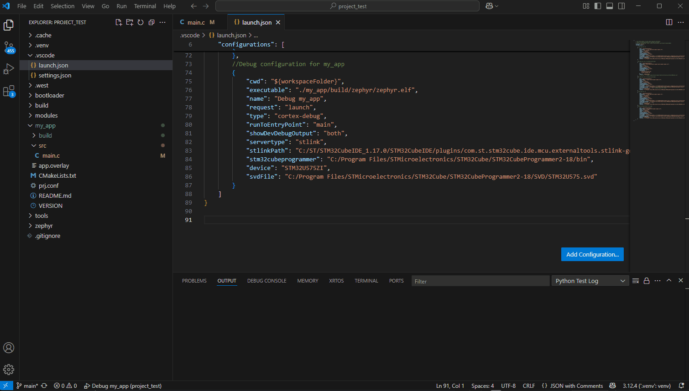

# Zephyr_FirstApp

This ReadMe is a step-by-step guide that will allow you to create your first application with the Zephyr OS. This guide follows the previous **[Zephyr Startup Guide](https://github.com/AntoinePST/Zephyr_Startup)** which presents one method to install the Zephyr environment on your computer. This **[Zephyr Startup Guide](https://github.com/AntoinePST/Zephyr_Startup)** is considered a prerequisite for following this tutorial.

In this guide, we will develop our application using Visual Studio Code and we will test it on a NUCLEO-U575ZI-Q board.\
It is divided into the following parts:

1. Zephyr Workspace Architecture
2. Writing a simple application
3. Build and Flash the application
4. Debug Configuration

This guide was written, among other things, thanks to the Zephyr **[Application Development](https://docs.zephyrproject.org/latest/develop/application/index.html)** page.

> [!IMPORTANT]
> This guide presents one method to accomplish the task, though other methods exist. You can adapt this approach as you wish. The process outlined here is effective and has been tested successfully.

> [!NOTE]
> Last update April 2025.
_______________________________________________________________


# 1. Zephyr Workspace Architecture

### 1.1 Prerequisite

If you followed the previous **[Zephyr Startup Guide](https://github.com/AntoinePST/Zephyr_Startup)**, your Zephyr workspace that we had called *zephyrproject* is stored in `C:/Zephyr_Repo/zephyrproject`.

```{.r code-copy=false}
zephyrproject/                       // WORKSPACE
   ├─── .venv/                       // Python virtual environments configuration
   ├─── .west/                       // West configuration and manifest repository
   ├─── bootloader/                  // Bootloader code and configurations
   ├─── build/                       // Build output directory
   ├─── modules/                     // External modules and libraries
   ├─── tools/                       // Additional tools and scripts
   └─── zephyr/                      // Zephyr OS source code and applications

```

### 1.2 Understanding the Zephyr Application Workspace

The build system is application-centric, and **requires Zephyr-based applications** to initiate building the Zephyr source code. The application build controls the configuration and build process of both the application and Zephyr itself, compiling them into a single binary.

As shown below, the Zephyr workspace (i.e. *zephyrproject*) contains all the essential parts of the Zephyr OS, like its source code, configuration files, and tools for building it. You might also have additional external modules installed with Zephyr which provide extra code from third parties that you can use in your applications.

In our case, we want to use Zephyr as a workspace. An application located within a workspace, but outside the Zephyr repository itself (i.e. `zephyr/`), is referred to as a Zephyr workspace application. This allows you to keep your applications separate from the core Zephyr code, making it easier to manage and update both your applications and the Zephyr OS.

In the following example, app1, app2, and app3 are Zephyr workspace applications:

```
zephyrproject/           // WORKSPACE
   ├─── .venv/                      
   ├─── .west/
   ├─── app1/            // User application 2
   │      └── src
   │         └── main.c     
   │      ├── […]
   │
   ├─── app2/            // User application 2
   │      ├── […]
   │
   ├─── app3/            // User application 3
   │      ├── […]
   │
   ├─── bootloader/
   ├─── build/
   ├─── modules/
   ├─── tools/
   └─── zephyr/       

```

### 1.3 Application Directory Structure

In the folder where you create your application, you will have files that connect your application with the Zephyr OS and any extra modules you need. This folder will have all the files specific to your application, such as configuration settings and the actual code you write.

Here is a typical structure of a basic Zephyr application:
```
<app>                  // Application folder
   ├── build/          // appears once you have built your app
   |    ├── […]
   |
   ├── src/
   |    └── main.c
   |
   ├── app.overlay
   ├── CMakeLists.txt
   ├── prj.conf
   └── VERSION

```

#### build/
> [!NOTE]
> This folder appears once you have built your application

This folder contains the files used to flash your microcontroller. Some interesting files in this directory include:

`buildephyrephyr.dts`: CMake uses a devicetree to tailor the build for your specific architecture/board. This is the final version of that file, where you can find all the different functionalities (GPIO, Timers, PWM, DMA, UART, SPI, I2C, DAC, USB, etc.) present on your MCU, which can then be used in your application.

`buildephyr/.config`: The final Kconfig used for your build. This can be useful to verify if a setting has been set correctly.

`buildephyrephyr.elf`: This is the final executable binary, containing the compiled code of your application and all its dependencies, used for flashing the target microcontroller or for debugging.

#### src/main.c
This is a source code file. Applications typically contain source files written in C, C++, or assembly language. According to Zephyr conventions, these files should be placed in a subdirectory named `src` within your application directory.

#### app.overlay
This is a devicetree overlay file that specifies application-specific changes which should be applied to the base devicetree for any board you build for. The purpose of devicetree overlays is usually to configure something about the hardware used by the application.

The build system looks for `app.overlay` by default, but you can add more devicetree overlays, and other default files are also searched for.

See [Devicetree](https://docs.zephyrproject.org/latest/build/dts/index.html#devicetree) for more information about devicetree.

#### CMakeLists.txt
This file instructs the build system on where to find the other application files and links the application directory with Zephyr’s CMake build system. This linkage provides features supported by Zephyr’s build system, such as board-specific configuration files, the ability to run and debug compiled binaries on real or emulated hardware, and more.

#### prj.conf
This is a Kconfig fragment specifying application-specific values for one or more Kconfig options. These settings are merged with other settings to produce the final configuration. Kconfig fragments are usually used to configure software features for the application.

The build system looks for `prj.conf` by default, but you can add more Kconfig fragments and other default files.

See [Kconfig](https://docs.zephyrproject.org/latest/develop/application/index.html#application-kconfig) Configuration below for more information.

#### VERSION
A text file that contains several version information fields. These fields let you manage the lifecycle of the application and automate providing the application version when signing application images.

See [Application version management](https://docs.zephyrproject.org/latest/build/version/index.html#app-version-details) for more information about this file and how to use it.


_______________________________________________________________


# 2. Create a simple application

### 2.1 Get the application template

The easiest way to create a Zephyr application is to start from an existing template. You can clone a template via the following Git repository to save time.

1. Open your terminal.
2. Navigate to your Zephyr project directory:

```sh
cd zephyrproject
```

3. Clone the application template:
> [!NOTE]
> If you haven't already set up your proxy and need to access the Git repository through a proxy server, configure your Git proxy settings, see [Proxy Setting](https://github.com/AntoinePST/Zephyr_Startup#2-proxy-setting) for more information.

```sh
git clone https://github.com/AntoinePST/zephyr_app_base my_app
```
This will create a new directory called **my_app** containing the template application.

### 2.2 Write your application

In this example, we will write an application that toggles an LED on the Nucleo board when the user button is pressed. We will use a callback for this purpose.

1. Open the `main.c` file in the `my_app/src/` directory.
2. Add the following code to configure the button and the LED:

```c
#include <zephyr/kernel.h>
#include <zephyr/device.h>
#include <zephyr/drivers/gpio.h>
#include <zephyr/sys/printk.h>  // Used for error messages

/*
 * Get button configuration from the devicetree sw0 alias. This is mandatory.
 * This retrieves the GPIO configuration for the button from the device tree.
 */
#define SW0_NODE DT_ALIAS(sw0)
#if !DT_NODE_HAS_STATUS_OKAY(SW0_NODE)
#error "Unsupported board: sw0 devicetree alias is not defined"
#endif
static const struct gpio_dt_spec button = GPIO_DT_SPEC_GET_OR(SW0_NODE, gpios, {0});
static struct gpio_callback button_cb_data;

/*
 * Get LED configuration from the devicetree led0 alias. This is mandatory.
 * This retrieves the GPIO configuration for the LED from the device tree.
 */
#define LED0_NODE DT_ALIAS(led0)
#if !DT_NODE_HAS_STATUS_OKAY(LED0_NODE)
#error "Unsupported board: led0 devicetree alias is not defined"
#endif
static const struct gpio_dt_spec led = GPIO_DT_SPEC_GET(LED0_NODE, gpios);

/*
 * Set the button callback action.
 * This function is called when the button is pressed.
 */
void button_pressed(const struct device *dev, struct gpio_callback *cb, uint32_t pins)
{
    // Toggle the LED state
    gpio_pin_toggle_dt(&led);
}

int main(void)
{
    // Configure the button pin as input
    gpio_pin_configure_dt(&button, GPIO_INPUT);
    gpio_pin_interrupt_configure_dt(&button, GPIO_INT_EDGE_TO_ACTIVE);

    // Initialize the callback function for the button press
    gpio_init_callback(&button_cb_data, button_pressed, BIT(button.pin));
    gpio_add_callback(button.port, &button_cb_data);

    // Configure the LED pin as output
    gpio_pin_configure_dt(&led, GPIO_OUTPUT);

    // Main loop
    while (1) {
        // Sleep for 1 millisecond to reduce CPU usage
        k_msleep(1);
    }
	return 0;
}
```

_______________________________________________________________

# 3. Build and Flash the application

Once your code is written, you can build and flash the application into your NUCLEO board.

1. Open your terminal.
2. Navigate to your application directory:

```sh
cd zephyrproject/my_app
```

3. Build the application for the Nucleo U575ZI-Q board:

```sh
west build -p always -b nucleo_u575zi_q
```

> [!NOTE]  
 > For more information on the *west* command and its arguments, please visit **[this](https://docs.zephyrproject.org/latest/develop/west/index.html)** page.

4. Flash the application onto the board:

```sh
west flash
```

**Now you should see the User LED blinking each time you press the User Button!**

> [!IMPORTANT]
> If the flash command (*west flash*) doesn't work, please refer to the troubleshooting section of the lastest guide via **[this link](https://github.com/AntoinePST/Zephyr_Startup#troubleshooting)**.


_______________________________________________________________

# 4. Debuging Configuration

### 4.1 Requirements
#### STMicroelectronics Software Tools

To facilitate the debugging of your Zephyr application on STM32, it is necessary to have STM32CubeIDE and STM32CubeProgrammer installed. In our specific case, we will use these tools as explained below:

- **STM32CubeIDE**: Used to access the ST-Link GDB server, which is necessary for debugging the application on the STM32 microcontroller in our case.
- **STM32CubeProgrammer**: Used to program the microcontroller with the ELF file generated by Zephyr and to use the SVD file library during debug.

> [!NOTE]  
> This method is not the only way to proceed and may vary depending on the preferences and configurations of each developer.

#### VSCode Extensions

To debug a Zephyr OS application with VSCode, you will also need to install the following extensions in VSCode:

- **[C/C++](https://marketplace.visualstudio.com/items?itemName=ms-vscode.cpptools)**: for C/C++ language support.
- **[Cortex-Debug](https://marketplace.visualstudio.com/items?itemName=marus25.cortex-debug)**: for debugging ARM Cortex microcontrollers.
- **[CMake Tools](https://marketplace.visualstudio.com/items?itemName=twxs.cmake)**: for managing CMake projects.

### 4.2 Create Debugging Files in VSCode

VSCode mainly uses two files for configuring debugging: `launch.json` and `settings.json`. These files are placed in the `.vscode` folder at the root of your workspace.\
Here is an overview of this folder:

```
.vscode/
    ├── launch.json
    └── settings.json
```

If this folder is not generated automatically, we can create it manually. Here are the steps to create these files:

1. Navigate to your Zephyr project directory and create the .vscode folder:

```sh
cd zephyrproject
```
```sh
mkdir .vscode
```

2. Go to the new folder and create the two files `launch.json` and `settings.json`:

```sh
cd .vscode && touch launch.json settings.json
```

#### `settings.json`

The `settings.json` file is used to configure project-specific settings in VSCode. These settings include the paths to the toolchain and debugger to ensure that VSCode can correctly debug the Zephyr application using the Cortex-Debug extension.

The `settings.json` file can also be used to configure the settings for the Zephyr extension and other tools.

To simplify the process, we will use fixed paths in our configuration to configure our environment. You will find below an example configuration for the `settings.json` file. Don't forget to modified **[PATH_TO: ...]** variable with the corresponding path in your case (I put my exact path from my config to give you an example below each *[PATH_TO: ...]*):

```c
{
    // Hush CMake
    "cmake.configureOnOpen": false,

    // Cortex-Debug settings
    "cortex-debug.armToolchainPath": [PATH_TO: arm-zephyr-eabi/bin],
    /* On my side -> "C:/Zephyr_Repo/zephyr-sdk-0.17.0/arm-zephyr-eabi/bin" */
    "cortex-debug.gdbPath": [PATH_TO: arm-zephyr-eabi/bin/arm-zephyr-eabi-gdb.exe]
    /* On my side -> "C:/Zephyr_Repo/zephyr-sdk-0.17.0/arm-zephyr-eabi/bin/arm-zephyr-eabi-gdb.exe" */
}
```

#### `launch.json`

This file defines the launch configurations for debugging. It contains the necessary parameters to debug your application.

To simplify the process, we will use fixed paths in our configuration to configure our environment. You will find below an example configuration for debugging an STM32U575 with STLink. Don't forget to modified **[PATH_TO: ...]** variable with the corresponding path in your case (I put my exact path from my config to give you an example below each *[PATH_TO: ...]*):

```c
{
    "version": "0.2.0",
    "configurations": [

        //Debug configuration for my_app
        {
            "cwd": "${workspaceFolder}",
            "executable": "./my_app/build/zephyr/zephyr.elf",
            "name": "Debug my_app",
            "request": "launch",
            "type": "cortex-debug",
            "runToEntryPoint": "main",
            "showDevDebugOutput": "both",
            "servertype": "stlink",
            "stlinkPath": [PATH_TO: ST-LINK_gdbserver.exe],
            /* On my side "C:/ST/STM32CubeIDE_1.17.0/STM32CubeIDE/plugins/com.st.stm32cube.ide.mcu.externaltools.stlink-gdb-server.win32_2.2.0.202409170845/tools/bin/ST-LINK_gdbserver.exe" */
            "stm32cubeprogrammer": [PATH_TO: STM32CubeProgrammer2-18/bin],
            /* On my side "C:/Program Files/STMicroelectronics/STM32Cube/STM32CubeProgrammer2-18/bin" */
            "device": "STM32U575ZI",
            "svdFile": [PATH_TO: STM32U575.svd]
            /* On my side "C:/Program Files/STMicroelectronics/STM32Cube/STM32CubeProgrammer2-18/SVD/STM32U575.svd" */
        }
    ]
}
```


### 4.3 Launch the Debug

Your setup is now complete, and we can start debugging our application. To do this, simply go to the `Run and Debug` tab in VSCode, select your debug setup from the available list, and press the play icon.



You will then find a small pop-up window with the basic functionality of debug mode which will allow you to control the program's execution with commands such as "Continue", "Step Over", "Step Into", and "Step Out".


When the debug mode is activated in VSCode, the left sidebar displays several panels and tools essential for debugging. Here is a description of the main features:

#### Variables
**Local:** Displays local variables and their current values. You can see the variables defined in the current scope of the code.\
**Global:** Shows the global variables accessible in the program.\
**Static:** Displays static variables, which are variables that retain their values between function calls and are shared across instances of a class.\
**Registers:** Shows the values of the CPU registers. This is particularly useful for low-level debugging, such as when working with embedded systems or performance-critical applications.\

#### Watch
Lets you add expressions you want to monitor. You can track changes in the values of these expressions as the program runs.

#### Call Stack

Displays the call stack, allowing you to see the sequence of function calls that led to the current state of the program. You can navigate through different levels of the stack to inspect the contexts of each call.

#### Breakpoints
Lists all the breakpoints you have set in your code. You can enable, disable, or remove breakpoints directly from this panel.
Conditional Breakpoints: Allows you to set specific conditions for breakpoints. The program will pause only if the condition is met.

#### XPeripherals
This feature provides a view of the peripherals connected to the system, particularly useful in embedded development. It allows you to inspect and interact with hardware components like timers, serial ports, and GPIOs. This can be crucial for debugging hardware-related issues and ensuring that peripheral configurations are correct.

#### Cortex Live Watch
Specifically designed for ARM Cortex processors, this feature allows real-time monitoring of variables and expressions. It provides an interactive view that updates as the program runs, enabling you to track changes and behaviors dynamically. This is particularly useful for performance tuning and ensuring that critical variables behave as expected during execution.

### 4.4 Troubleshooting Debugging

#### Setting Breakpoints Issue

Debugging a Zephyr application in VSCode can be challenging with a simple configuration, as it is not always possible to place breakpoints directly on some instructions.

For example, in the example we just wrote, it's not possible to place a breakpoint in the button press callback function to stop the execution of the code in this function when a button is pressed:


One of the workarounds found is to **insert logging statements** before the targeted instruction and then click on step over.

In our case, we will therefore add the following line just before toggling the LED in the button callback function:

```c
printk("BreakPoint #1");
```
We can now place a breakpoint on this new line and stop the execution of the code where we want:


#### Connect to Target Issue

Some STM32 targets require specific conditions to connect to the debugger.

In case of connection problems, it is possible to retrieve the exact command needed for the target to connect in STM32CubeIde. This simply allows you to know the necessary parameters to enter in the `launch.json` file to correctly configure the debugger.

Here is a concrete example with an **STM32H533RE**. If we modify our previous configuration by simply adapting it to the STM32H533, here is what we could expect to see in the `launch.json` file:

```c
{
    "version": "0.2.0",
    "configurations": [

        //Debug configuration for my_app
        {
            "cwd": "${workspaceFolder}",
            "executable": "./my_app/build/zephyr/zephyr.elf",
            "name": "Debug my_app",
            "request": "launch",
            "type": "cortex-debug",
            "runToEntryPoint": "main",
            "showDevDebugOutput": "both",
            "servertype": "stlink",
            "stlinkPath": [PATH_TO: ST-LINK_gdbserver.exe],
            /* On my side "C:/ST/STM32CubeIDE_1.17.0/STM32CubeIDE/plugins/com.st.stm32cube.ide.mcu.externaltools.stlink-gdb-server.win32_2.2.0.202409170845/tools/bin/ST-LINK_gdbserver.exe" */
            "stm32cubeprogrammer": [PATH_TO: STM32CubeProgrammer2-18/bin],
            /* On my side "C:/Program Files/STMicroelectronics/STM32Cube/STM32CubeProgrammer2-18/bin" */
            "device": "STM32H533RE",
            "svdFile": [PATH_TO: STM32H533.svd]
            /* On my side "C:/Program Files/STMicroelectronics/STM32Cube/STM32CubeProgrammer2-18/SVD/STM32H533.svd" */
        }
    ]
}
```

However, when you run the debugger of our application you should get an error message saying that it is impossible to connect and display `Target unknown error 32`:


> [!WARNING]
> If you want to test on your side, don't forget to re-build the application for the target `nucleo_h533re`.

To easily access the correct configuration, Open any example project for your NUCLEO-H533RE in STM32CubeIDE. Open the `Debug Configurations` and then in the `Debugger` tab click on `Show Command Line` to display the complete command used to connect to the connected target:


The command line displayed is as follows:
```debug_cmd
C:\ST\STM32CubeIDE_1.17.0\STM32CubeIDE\plugins\com.st.stm32cube.ide.mcu.externaltools.stlink-gdb-server.win32_2.2.0.202409170845\tools\bin\ST-LINK_gdbserver.exe -p 61234 -l 1 -d -s -cp C:\ST\STM32CubeIDE_1.17.0\STM32CubeIDE\plugins\com.st.stm32cube.ide.mcu.externaltools.cubeprogrammer.win32_2.2.0.202409170845\tools\bin -m 1 -k
```

We notice that ST-LINK GDB server uses specific parameters to connect to the STM32H533RE: `-m 1 -k`. So we will add the following line in our configuration in the `launch.json` file to specify these arguments.

```c
"serverArgs": ["-m", "1", "-k"],
```
You should now be able to run debug for an STM32H533RE.
